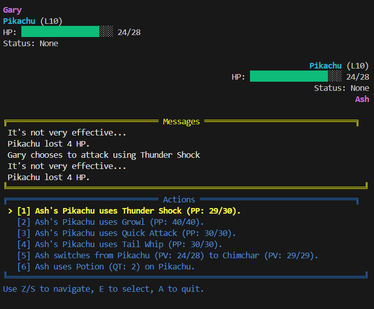

# Pokemon Battle Simulation Engine

[](https://www.python.org/downloads/release/python-3130/)
[](https://opensource.org/licenses/MIT)
[](https://github.com/astral-sh/ruff)

A high-performance, extensible Pokemon battle simulation engine written in Python. Designed with Reinforcement Learning (RL) and AI research in mind, it provides a robust environment for training agents, simulating battles, and testing strategies.

## 🚀 Features

*   **Complete Battle Mechanics**: Implements turn-based combat, type effectiveness, move categories (Physical, Special, Status), stat modifiers, and status conditions (Burn, etc.).
*   **AI-Ready**: Built-in support for tensor representations of game state, making it easy to integrate with PyTorch for Deep Reinforcement Learning.
*   **Customizable**: Easily create custom Pokemon, Moves, Items, and Trainers.
*   **Interactive UI**: Includes a command-line interface (CLI) for human-vs-human or human-vs-AI battles, or even AI-vs-AI battles.
*   **Performance**: Optimized for speed to facilitate rapid training of AI agents. Capable of simulating over **210,000 turns per second** on a standard laptop (12th Gen Intel i5-12450H).

## 📦 Installation

You can install the package directly from the source:

```bash
git clone https://github.com/eliottcrancee/pokemon-sim-engine.git
cd pokemon-sim-engine
pip install .
```

Or using `uv` (recommended):

```bash
uv sync
```

## 🎮 Quick Start

### Running a UI Battle

To jump straight into a battle between Ash and Gary:

```bash
uv run python run_ui_battle.py
```



## 📖 Usage Guide

Here is a complete example of how to set up a battle programmatically.

### 1. Setup Trainers and Pokemon

```python
from pokemon.pokemon import PokemonAccessor
from pokemon.item import ItemAccessor
from pokemon.trainer import Trainer

# Create Pokemon instances
pikachu = PokemonAccessor.Pikachu(level=50)
charmander = PokemonAccessor.Charmander(level=50)

# Create Items
potion = ItemAccessor.Potion(default_quantity=2)

# Create Trainers
ash = Trainer(
    name="Ash",
    pokemon_team=[pikachu],
    inventory={potion.name: potion}
)

gary = Trainer(
    name="Gary",
    pokemon_team=[charmander],
    inventory={potion.name: potion}
)
```

### 2. Initialize Battle and Agents

```python
from pokemon.battle import Battle
from pokemon.agent import InputAgent, RandomAgent

# Initialize Battle
battle = Battle(trainer_0=ash, trainer_1=gary, max_rounds=100)

# Create Agents
# InputAgent allows human control via CLI
agent_0 = InputAgent(name="Ash")
# RandomAgent makes random valid moves
agent_1 = RandomAgent(name="Gary")
```

### 3. Run the Battle

You can run the battle using the UI helper or manually step through it.

**Using the UI:**

```python
from pokemon.ui import play_ui

play_ui(battle, agent_0, agent_1)
```

**Manual Loop (with AI Agents):**

```python
# Use RandomAgent for both sides for this example
agent_0 = RandomAgent(name="Ash")
agent_1 = RandomAgent(name="Gary")

while not battle.done:
    # Get actions from agents
    action_0 = agent_0.get_action(battle, 0)
    action_1 = agent_1.get_action(battle, 1)
    
    # Execute turn
    battle.turn(action_0, action_1)

print(f"Winner: {battle.winner}")
```

## 🧪 Development

To run the tests and benchmarks, ensure that `DEBUG` is set to `True` in `src/pokemon/config.py`.

```bash
uv run pytest
```

To run benchmarks:

```bash
uv run pytest --benchmark-only
```

## 📄 License

This project is licensed under the MIT License - see the [LICENSE](LICENSE) file for details.

## 🤝 Contributing

Contributions are welcome! Please feel free to submit a Pull Request.

